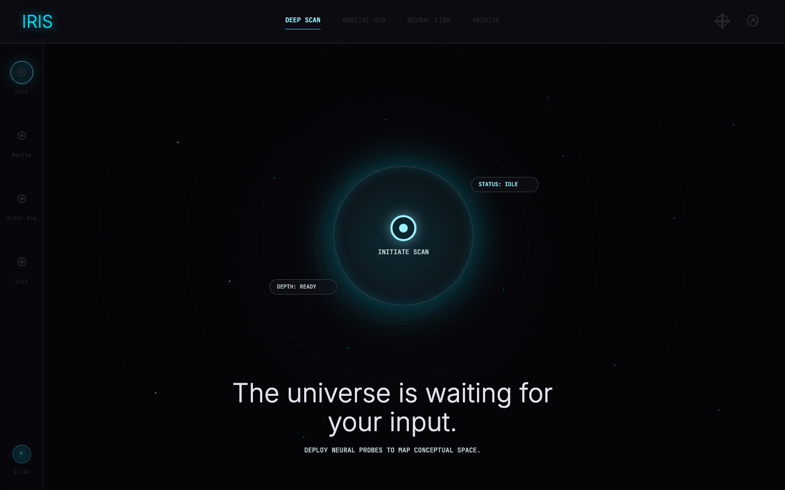

# Day 2 Stage 1 Stitch Static Layout

Date: 2026-06-07

Scope: visual layer only. The Iris engine, prompts, validation gate, and MiniCPM
configuration were not changed.

## Source Design

- Stitch project URL: `https://stitch.withgoogle.com/projects/16939309035458127364`
- Local Stitch export: `stitch_iris_atomic_infinite_zoom/`
- Primary reference state: `iris_the_beginning_desktop/screen.png`

## What Changed

- Replaced the prior Gradio form/card shell with a full-bleed spatial canvas.
- Matched the Stitch beginning state: dark void, top nav, left depth rail,
  faint concentric orbital rings, glowing central nucleus, status chips, and
  bottom hero copy.
- Kept `stream_spiral()` and the validated engine untouched for Stage 2 wiring.

## Screenshot



## Browser Smoke

- Desktop `1440x900`: full-bleed canvas at `x=0,y=0`, no horizontal overflow.
- Mobile `390x844`: no horizontal overflow.
- Local server: `http://127.0.0.1:7860`

## Automated Checks

```bash
python3 -m unittest discover -s tests
python3 -m compileall iris tests app.py
./scripts/check_repo.sh
```

Result: passed.

## Decision

Stage 1 is ready for Khalid's visual confirmation before Stage 2 wiring.
